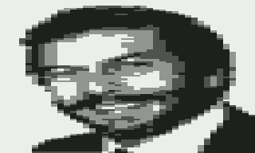
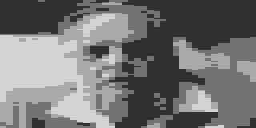
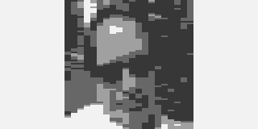
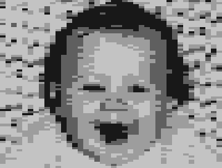

# JiggleSoft's Atari 2600 Image Converter

## Introduction

This repository contains a web application that can convert bitmap images to Atari 2600 source code.

## Application

 * NOTE THIS APPLICATION IS NOT IN A PRODUCTION STATE SO IS NOT CURRENTLY AVAILABLE - BUT WILL BE SOON

Please click [LAUNCH](www/index.html).

## Examples

---

## Licensing

   Copyright (c) 2020 Justin Lane

   Licensed under the Apache License, Version 2.0 (the "License");
   you may not use this file except in compliance with the License.
   You may obtain a copy of the License at

       http://www.apache.org/licenses/LICENSE-2.0

   Unless required by applicable law or agreed to in writing, software
   distributed under the License is distributed on an "AS IS" BASIS,
   WITHOUT WARRANTIES OR CONDITIONS OF ANY KIND, either express or implied.
   See the License for the specific language governing permissions and
   limitations under the License.

## Contact Us

Please email atari2600@jigglesoft.co.uk regarding this repository.

